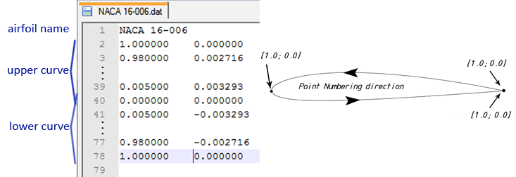

# XFOIL Airfoil Analysis

[official page](http://web.mit.edu/drela/Public/web/xfoil/)

- Viscous (or inviscid) analysis of an existing airfoil, allowing
  - forced or free transition
  - transitional separation bubbles
  - limited trailing edge separation
  - lift and drag predictions just beyond CLmax
  - Karman-Tsien compressibility correction
  - fixed or varying Reynolds and/or Mach numbers
- Airfoil design and redesign by interactive modification of surface speed distributions, in two methods:
  - Full-Inverse method, based on a complex-mapping formulation
  - Mixed-Inverse method, an extension of XFOIL's basic panel method
- Airfoil redesign by interactive modification of geometric parameters such as
  - max thickness and camber, highpoint position
  - LE radius, TE thickness
  - camber line via geometry specification
  - camber line via loading change specification
  - flap deflection
  - explicit contour geometry (via screen cursor)
- Blending airfoils
- Writing and reading of airfoil coordinates and polar save files
- Plotting of geometry, pressure distributions, and multiple polars

## Interface

- XFOIL is an interactive program for the design and analysis of
  subsonic isolated airfoils.
- Analysis is performed using text user’s interface (keyboard input).


## Load airfoil

### Load airfoil from text file

```text
LOAD filename.txt
```

`filename.txt` – name of the coordinates file



### Use NACA 4-series airfoil

```text
NACA XXXX
```

`XXXX` – 4 digit code for a NACA airfoil (example 2312)

{: .important }
> In XFOIL, the X and Y coordinate delimiter is mutiple space symbols, not tabs

## Analysis

- `OPER` – direct analysis routine
- `?` – will display list of available commands


### Set analysis parameters

- `VISC` – toggle viscous/inviscid mode
- If viscous mode is enabled, enter the Reynolds number
- `Mach` – set Mach number to account for compressibility effect.
- `PACC polar.txt` – enables accumulation of polar to text file. 
  All analysis runs will be stored to `polar.txt` textfile

### Analysis at a given Angle of Attack

- `ALFA 4` – runs analysis of current airfoil at 4 degrees angle of attack
- `CPWR filename.txt` – saves $C_p$ vs. $x/c$ distribution to text file


### Improve convergence

- `ITER` – set number of iterations if XFOIL failed to converge

Example of not converged solution at 18 degrees

```text
ALFA 18
```


Modify number of iterations. Solution converged.

```text
ITER 50
ALFA 18
```


### Smooth airfoil

`PANE` – automatically smooth airfoil if number of points is too low.
Xfoil automatically computes required number of points and their
distribution.

Example of airfoil with poor quality


Example of airfoil after processing


### Run analysis for series of angles of attack

runs XFOIL for sequence of angles of attack from 0 to 20 with 0.5-degree
increment

```text
ASEQ 0 20 0.5
```

[sequence of angles of attack](xfoil-8.png)

## Run Sequence

[Download](http://web.mit.edu/drela/Public/web/xfoil/) and run `xfoil.exe`

1. `LOAD GA37A315.txt` – load airfoil from text file
2. `OPER` – enter analysis routine
3. `VISC 3000000` – enable viscous flow analysis and set Reynolds number to 3×10^6
4. `Mach 0.3` – set Mach number to 0.3
5. `PACC newPolar.txt` – enable results accumulation to text file
6. `“Enter”` – press enter to disable dump file
7. `ASEQ 0 20 0.5` – run analysis at angles of attack from 0 to 20 with
   0.5 degree increment
8. `PACC` – disable polar accumulation
9. `“Enter”` – go to one level up
10. `QUIT` – exit the program
